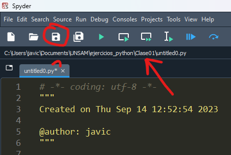

# Ejercicios Python - Programación 1

Este repositorio tiene el único propósito de probar los ejercicios que hagan durante la cursada de Programación 1.

Pueden descargar todo como .zip y descomprimirlo en sus computadoras desde
[acá](https://github.com/JaviCeRodriguez/ejercicios_python/archive/refs/heads/main.zip), o pueden clonar el repositorio
utilizando git: `git clone https://github.com/JaviCeRodriguez/ejercicios_python.git`.

## ¿Cómo hago los ejercicios de cada clase?

### Desde Spyder:

Seteamos nuestro entorno de trabajo haciendo clic en el ícono de la carpeta:

Buscamos la carpeta de la clase (en mi caso, selecciono Clase01):

Chequeamos que hayamos abierto la carpeta correctamente:

Ahora, podemos escribir scripts de .py en la carpeta seleccionada. Aseguremos que
aparezca la carpeta arriba de los scripts, como en el ejemplo:

En caso de que aparezca un asterísco a la derecha del archivo, eso significa que no guardamos
los cambios o no está creado el archivo. Dar clic en el ícono de Guardar.

### Desde Visual Studio Code:

En este IDE es más sencillo. Pueden arrastrar la carpeta al VSCode abierto o al ícono creado
en el escritorio.

También, similar a Spyder, pueden buscar la carpeta desde `File > Open Folder...` y listo.

## ¿Cómo ejecuto los archivos .py?

- Desde Spyder

- Desde Visual Studio Code:

- Desde la terminal